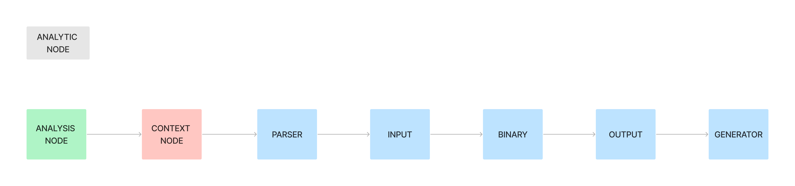

> Note: This project began as a highly exploratory [go project](https://github.com/killthebuddh4/gadfly-go). We ended up with a much clearer picture of what we wanted to build and also the realized that golang is not the right tool for the job.

## Overview

_2024-04-14 -- I might be ready to make this a real thing, I [made a (wip) deck](https://www.canva.com/design/DAGCbH7Q9nw/cWEMoBESe1JUii0SxWhIRA/view)_

__Gadfly__ is an AI agent framework. It's core is a natural language compiler, programming language, and orchestration engine. A Gadfly agent satisfies natural language requests by writing scripts and then executing them.

A Gadfly agent's interface is natural language. When it receives a request it _parses_ the request into a program in the Gadfly language, a very simple and very high level functional programming language. It then _compiles_ the program into a collection of source files in a general purpose programming language. Finally, it orchestrates the execution of the collection of source files.

## (WIP) Litepaper

_[Some helpful diagrams](https://www.figma.com/file/jYFPoCavF5E4FJOa5CYwjP/gadfly?type=whiteboard&node-id=0%3A1&t=VfQlWVZY9yWlPsty-1)_

_

When we think of how a programming language executes, a common way to start is by thinking of the program's source code as a tree (a parse tree). The leaf nodes in the tree are executed first and yield values. The values are propagated upwards as inputs into their parent nodes, which represent functions. And so on. In this way we imagine data flowing from the leaf nodes _upwards_ towards the root of the tree. When the program halts, the root node in the tree is the result of the program.

In Gadfly we do things a little bit differently. We think of _natural language user input_ as a program's ultimate source code. When execution begins, i.e. at the moment the input is received, the parse tree doesn't exist. When execution begins, data flows _downward_ from the root, _generating the parse tree_ just in time.

_N.B. It's kind of confusing and good to remember that analytic nodes operate on synthetic data and synthetic nodes operate on analytic data._

We call this downward execution the _analytic mode_. The code which implements the analytic mode is a lot like a parser. It decomposes the user input into a tree of sub-requests. We call the upward mode the _synthetic mode_ and the code which implements it is like an interpreter. In the synthetic mode we synthesize values that represent solutions to the sub-requests. In between the analytic and synthetic modes there is a compilation step where the analytic nodes in the Gadfly parse tree are compiled into corresponding synthetic nodes written in a general purpose programming language. _It is the job of the execution engine to orchestrate sequences of analytic, synthetic, compilation, backup, and retry steps._

We call natural language "synthetic data" and "traditional" data "analytic data". So we have this picture of synthetic data starting at the root and flowing down to generate the leaves of a tree and we have analytic data flowing up from the leaves to the root. As the program executes, the execution engine flipflops between the synthetic and analytic modes, backing up on occasion, and retrying things when prudent. _The implementation details of this process is the central problem Gadfly attempts to solve._

The Gadfly language includes the following keywords (used in the analytic mode):

- `switch`
- `parallel`
- `serial`
- `function`

`switch` takes as input some synthetic data and routes it through one of N parse trees.

`parallel` takes as input some synthetic data and routes it through all of N parse trees.

`serial` takes as input some synthetic data and routes it through a series of N parse trees in order.

`function` takes as input some synthetic data and returns a generated source file.

## Down the road

Gadfly agents write programs by "inlining everything". There's no names, variables, closures, etc. Every request results in a brand new parse tree. We think that this will be fine in the near term because of the kinds of real-world problems we're targeting. We do think that eventually these limitations will start to matter for basically the same reasons we humans don't write code this way. We envision two features that will go a very long way, _subtree parameterization_ and _named subtrees_. Subtree parameterization is basically function definitions applied to the analytic mode. Named subtrees are like traditional variables but accessible from anywhere deeper in the tree without needing to hoist the definitions.

Gadfly doesn't include loops but we think that's probably fine. When you're authoring a program you're not really writing the same function over and over again until some condition is met.

## Notes

2024-03-30-00

Think about some structured ways you could change the prompts:

- Use a system message vs include in convo
- You vs we
- Markdown vs plaintext
- Re-ordering the documentation for functions (or explicitly tell it to prefer one)
- Using less-overloaded phrases (like FUNCTION)
- Instead of saying "what technique to start?" we could use "What technique should we apply?"
- Trying more than one solution and then selecting the best outcome.

2024-03-30-01

What are the different ways to generate the next serial problem? What are the different states the tree could be in?

- generate whole series at once
- generate next given root and previous problem
- generate next given root and previous problem and previous problem's solution

_NOTE TO SELF_ Remember to keep thinking about everything in terms of operations on a tree. By always framing things in terms of tree operations, we can maintain some invariants and program the tree. We have to continuously map _semantic operations_ onto tree operations.

2024-04-01-00

- request user input
- try something new
- respond to signals

synthetic node:

- problem
- supervisor
- history
  - hypothesis
    - analysis
    - synthesizer
  - conclusion
  - analytic node
  - children

synthetic edge

- source
- target
- reasoning

context

node
  classification
  analysis
  synthesis
  children

2024-04-01-01

Ok so I think I have a pretty strong starting point for the general architecture of the engine.

What we have is a _synthetic program_ that is being continuously compiled into an _analytic program_. A synthetic node is a node with a natural language problem statement and without a script that implements a solution. An analytic node is a way to pull data from the synthetic program, execute it as a computer program, and then return the results to the synthetic program. An analytic program is a synthetic program where every leaf node is an analytic node. It's like a synthetic program that has been "solved" or "implemented".

Visually:

A synthetic program has a kind of ordering to it. A synthetic node is at the root, representing a problem. An analysis is generated which classifies the problem and determines a high-level strategy. The root problem and strategy are then used to derive some context for each sub problem the strategy requires. Each problem is a synthetic node. And so on. Sometimes the strategy is "analytic" which means that we decide to solve the problem directly using a program written in a general purpose programming language. Generation terminates when all leaf nodes are "analytic".

An "analytic node" is direct solution to a problem. It's basically a script that's executed inside a kind of framework which binds the script to the synthetic program. It looks like this:

Now, every node in the synthetic program is not "really" a node, it's an enitre history of node versions called an _evolution_. Every evolution, like a synthetic program, has an ordering to it. It goes node -> review -> patch -> node. Visually:

Every evolution has a _supervisor_ which is responsible for controlling the evolution. It conducts reviews and applies patches.

__NEXT__

I'm still thinking about exactly how to structure the relationship between a node and an evolution. Is a supervisor part of a node, and an evolution part of a node? Is there two trees, a node tree and an evolution tree, that have to be synchronized all the time? Does a node see its children's evolutions? Or does a node see its own evolutions? These are all questions that I'll need to think about. It doesn't have to be perfect right away, but I at least need to get to a point where I have a structure in my head that intuitively makes sense to me.

...

2024-04-01-02

restart policy

top-down vs bottom-up design

Where would a node need to get feedback from?

- parent
- child
- 

So I was working through this idea of a node's evolution and it led me to thinking about the events which would trigger an iteration. Now I'm thinking about the evolution as a series of event -> patch -> new node. The system for generating events (feedback and signals) is something like this:

One hangup I have with the above diagram is that it only allows for synthetic nodes to emit events. I'm not sure that's not ok, but I'm not sure it's ok either. I need to keep thinking this through.

2024-04-02-00

So we have a 

- signal (definition, spec)
- o
  

So every node has a 

governor, controller, and supervisor

the controller is responsible for interpreting feedback

controller's responsibility is generating patches
supervisor's responsibility is handling errors (generate a patch or propagate?)
governor's responsibility is generating feedback

governor generates feedback, only inside synthetic nodes
supervisor generates feedback, only inside analysis nodes
hypervisor maintains system-wide invariants

evaluate
QA (target, result) -> delta
feedback
ENGR (target, result, delta) -> feedback
patch
SUPERVISOR (history, feedback) -> patch
iterate
TECHNICIAN (node, patch) -> next node

throw errors
catch errors

governor
supervisor
controller
hypervisor

every edge
every node

in general, nodes can _only_ talk to their children

governor -> a node can generate feedback and send it to all children
controller -> the child receives feedback and then generates a patch
agent -> a patch is then applied to the node to create a new node

Analysis might sometimes be a lossy operation. We need some kind of a mechanism to rehydrate child nodes.

Governors are responsible for multi-hop loss management related to specific details of the synthetic data. This is like the synthetic cybernetic flow.

Hypervisors are responsible for maintaining system-wide invariants, invariants are properties that do not change as synthetic data changes.

Supervisors are responsible for failure management, in some sense. Supervisors are more about execution and analytic stuff.

Controllers take in patches and output new nodes.

feedback -> patch -> node

Every node has a controller which is responsible for iterating on the node

_The most important thing, which I'm thinking about very very very indirectly, is how to keep the context windows small. I think if you can keep context windows from blowing up, you can build something insane._

The governor is responsibe for defining the target signal.

The supervisor's role is for keeping the thing running.

The controller's role is to integrate feedback into new versions.

The hypervisor's role is to maintain system invariants.

2024-04-02-01

Ok so I think it's too early get too caught up in the cybernetic components. I've settled on four decisions that I think are future-proof and enough to keep moving:

I need _something_ that has visibility to the overall _reference signal derivation_ process.

I need _something_ that has visibility to the overall _real signal generation_ process.

I need _something_ that maintains generic invariants in certain parts of the systm

I need _something_ that is only and fully responsible for a single node's history.

2024-04-02-02

One of the "first high-level programming languages" was explicitly a "planning language" [Konrad Zue Plankalkul](https://en.wikipedia.org/wiki/Plankalk%C3%BCl)

2024-04-03-00

If you only have switch, parallel, and serial, and you fix the number of arguments for each at 10, then a 10 depth tree has 400 trillion leaves. I.e. there's 600 trillion ways to contstruct a 10 depth plan. And that is if we don't include the choices for arguments. So obviously we can't explore all paths. So obviously we aren't exploring all paths. That's where the language model comes in.

SyntheticNode
SyntheticEdges
SyntheticEdge
AnalyticNode
AnalyticEdge
AnalyticEdges

2024-04-03-01

An agent is not a long-lived thing. An agent is an autonomous generator function.

2024-04-04-00

Ok so I have a really, really nice network substrate to build on top of. I did a lot of tinkering with the high-level architecture in the last few days. It was a productive few days in terms of developing my intuitions about the problem, but in the end I realized that I was trying to think about too many problems at once. On the one hand, there's the messaging architecture, on the other hand there's the logical architecture. It's kind of like there's an execution layer, or something like that. An execution engine or medium. And there's the semantic layer.

Eventually what happened was I happened into a _really, really_ (I think) promising execution layer made up networks, actors, and proxies. It's just a super basic message hub kind of thing with the ability to intercept messages and forward them. Actors are the core messaging element. Then there's an _agent_ which is like the entry point to a nested network of actors. An agent is like an encapsulate cluster of actors. Being able to encapsulate clusters I think is going to be the way we're able to test dialectical patterns, or somethign like that. I got a basic dialectic flow working, actually.

I'm not 100% sure what I need to do next. I'm not sure if I need to write some PoC tools for working with the networks/clusters or if I'm ready to start testing the hierarchical dialectical process. _Actually I think I need to just write down exactly what that hierarchical process looks like._

2024-04-04-01

A synthetic node is a natural language description of a problem.

An analytic node is a general purpose program that solves the problem.

Thinking about it this way makes a lot more sense I think. It makes the relationships between natural language objects more obvious and it makes the relationships between analytic objects more obvious. It shows the flow of data way better. Easier to see the "parse tree" emerging.

Here's a new question. Are analytic nodes agents? For example, do analytic nodes try to run a program, interpret the results, and then forward the data to their parents? Or, do synthetic nodes handle _all_ of the natural language functionality.

I think that they are probably both agents because they have two distinct roles. A synthetic node needs to understand the plan, an analytic node needs to understand just the single step.

2024-04-05-00

SYNTHETIC NODE

- execute analytic node
- success or fail
- feedback or return or fail
- repeat

ANALYTIC NODE

- decide on type
- generate strategy
- generate children
- execute children
  - for each success or fail
  - feedback or return or fail
- success or fail
- feedback or return
- repeat

2024-04-08

What are the things I know for sure regarding sequences, processes, actors, nodes, and expressions? Irrespective of that particular taxonomy. What are the underlying truths I know? For example, I know that I need to at some point end up with an _expression_ that gets _evaluated_. In fact, the current interface I think is pretty True:

- expand
- evaluate
- reduce
- return

So I somehow have to build that API using the underlying mechanisms. There's a few more candidates for truths I can talk about right now:

- the exec, patch, kill, yield, query, error signals seem pretty solid
- the idea of a _sequence_ that converges I think is pretty solid
- the idea of a _process_ that is a sequence of sequences I think is pretty solid.

One thing that's tough is that a "sequence" of messages always spans two "actors". It's like what _is_ an _actor_?

Maybe an actor is how we implement an expression? ok, current thinking:

- Is every edge a process?

What do the actors at either end of the process do?

I just need to think a little bit harder, bottom up, about these ideas. Gonna sleep on it.

2024-04-09-00

Quick note: there's actually 2 kinds of queries:

- one analogous to name resolution
- one analogous to "what am i supposed to do"

In a `block` the thing you're supposed to do sometimes depends on what to do next, but not always. sometimes you're computing a value to be used later on, sometimes you're just generating a side effect.

I guess if you think of:

do f
do g with f
do h with g

return 

as 

return f(g(h(data)))

then you avoid the ambiguity. Does it make sense for us to try to avoid the ambiguity?

# Notes 2024-04-23

An actor is basically completed defined by the behavior of a number of event handlers:

- onParentChange
- onChildFeedback
- onFreeInputChange
- onBoundInputChange
- onBoundOutputFeedback
- onFreeOutputFeedback

I need to first decide exactly what data needs to be written where on each of those events. i.e. what is the protocol for each of those events. once i settle on something i need to create factory functions that allow us to implement specific behaviors.

SIDE NOTE: One thing I haven't thought much about in this iteration of the protocol is evolution/annealing: Where do map/filter/reduce operations fit into the current scheme?

# Notes 2024-04-24

_What do you have to do when a bound variable widens?_

This means that someone took something back, so you have to make sure it still works for you.

_What do you have to do when a bound variable narrows?_

if you're already working, then you don't need to do anything.

but you should probably recompute.

_What do you have to do when a bound variable is written?_

Recompute everything.

_What do you have to do when a bound variable's type widens?_

check to see if the variable could theoretically go bad, make sure you listen to changes.

_What do you have to do when a bound variable's type narrows?_

if you're already working, nothing. otherwise, see if you work now.

_What do you have to do when a bound variable's type is written?_

Recompute everything.

_What do you have to do when a free variable widens?_

Recompute everything

__WAIT, let's just recompute everything whenever an input changes for now__

__WHAT ARE THE STATES AN ACTOR CAN BE IN????__

_What do you have to do when a free variable narrows?_
_What do you have to do when a free variable is written?_
_What do you have to do when a free variable's type widens?_
_What do you have to do when a free variable's type narrows?_
_What do you have to do when a free variable's type is written?_
_What do you have to do when a context variable widens?_
_What do you have to do when a context variable narrows?_
_What do you have to do when a context variable is written?_
_What do you have to do when a context variable's type widens?_
_What do you have to do when a context variable's type narrows?_
_What do you have to do when a context variable's type is written?_
_What do you have to do when you get feedback on a bound variable?_
_What do you have to do when you get feedback on a free variable?_
_What do you have to do when you get feedback on a context variable?_

__What is the actor lifecycle__

So there's more than just variables. There's something like "controls", control sequences.

An Actor might be an Expression.

An Expression is something that is, you know declarative. It's something that is supposed to "make sense" eventually. The expression is responsible for wiggling into correctness space.

Expressions respond to changes in variables, but what is responsible for creating and removing variables?

I think an Actor is actually this think that oversees the expression lifecycle. I need to think about this a little bit more.

addBoundVariable
addFreeVariable

# 2024-04-26

There's 2 kinds of engines: a dialectical engine and an analytical engine.

The analytical engine generates a tree structure.
The dialectical engine generates a dag structure.

The whole thing operates as an interleaving of analytical and dialectical engines.

A dialectical engine is about making decisions.
An analytical engine is about executing decisions.

A synthetical engine which operates according to the dialectic calculus.
An analytical engine which operates according to the lambda calculus.

The synthetical engine flows down a tree. The analytical engine flows up a tree.

The tree is 

An expression is:

DV -> IV
   -> IV
   -> IV
   -> IV

Every expression is either synthetic or analytic.

A synthetic expression is one where the DV's value _uses_ the IVs' values but it is not obvious whether the DV's value satisfies its type. To know if the expression is consistent, it must be "executed". In a synthetic expression, the IVs are like "tools".

An analytic expression is one where the DV's value is _derived_ from the IVs' values and obviously satisfies its type. In an analytic expression, the IVs are like "preconditions".

Every expression has an operator. The operator is either a map, filter, or reduce operator. A map operator transforms each input into something new. A filter operator selects values. A reduce operator combines the values into a single new value.

How do we combine map/filter/reduce to create things like short circuits?

# Notes 2024-04-29

So I've got the simple core somewhat stable, I think. Expressions, variables, types. All with a kind of mutation that look the same as each other.

Big open questions I'm noodling on. The simulation/dag part of the system should be something like "every message forks the entire system, the simulation manages the forks". But it's hard to think about how a system where every single message forks it would work. I also have a wierd intuition that the solution will be simple. Something like "fork when you encounter an unknown history". So that's one of the two big questions in my head. The other one is the specifics of what a mutation on an expression looks like. We look at variables and types as basically an append-only mutation log, a derived state. For variables and types I think I get it, but what about for an expression? So that's the other big question in my head.

_I'm getting so close though._

# Notes 2024-04-30

OP_CODES

VAL_WRITE
VAL_WIDEN
VAL_NARROW
TYPE_WRITE
TYPE_WIDEN
TYPE_NARROW
ACTOR_GEN
ACTOR_GEN_IV
ACTOR_GEN_BV
ACTOR_GEN_CPU
ACTOR_GEN_DV
EVOLUTION_MAP
EVOLUTION_REDUCE

# Notes 2024-05-02

I think the core data model is _extremely close to v0.0.1_. The primitives we have right now cover a huge fraction of general purpose computing/source code. At the very bottom there is only two "atoms"--Value and Computer--and the rest of the model flows elegantly from there. The computation/expression side of things has a clean binding/coupling with simulation because only the two atoms ever need to be simulated. The simulation side of things is also itself elegant and makes sense and I think the _parameter/feedback_ "paradigm" is going to be a great start at the very least. So the __NEXT STEPS__:

1. I started writing some endpoints and events, starting from the ground up "boot a network.". I need to just keep going with this: implement the core endpoints/events/operations that need to get done.

2. Write down the core data model and protocol, clean up (among other things) this README.

# Notes 2024-05-03

Continuing to drill into the core. I'm pretty happy because I'm not spinning in place, getting stuck, feeling lost (like I have been in the past). Rather, I feel like I've developed (and am continuing to develop) a very solid/robust mental image of what the system is supposed to look like. I feel like I'm drilling down into something that I know is there and I'm inching my towards.

The very next thing I need to think about is the relationship between:

- a node
- a group of nodes
- an edge
- a group of edges
- parameters, feedback, and values
- a "decision"
- a "computation"

# Notes 2024-05-03-01

So I'm all the way down at the most basic primitives possible: we have

- nodes and edges
- a "computation" is defined as a set of input nodes and output nodes. one thing that's interesting about this is that we can build up computations incrementally and we can therefore validate/verify/backup incrementally.

We have DAGs and trees. We need a primitive for generating these data structures. Basically a WAL that can be used to reconstruct/rewind the structure.

Thinking about the fundamental kinds of DAGs. There's ways of generating a DAG and ways of executing a DAG. For example map/reduce (i.e. natural selection and/or experiments) is a way to generate AND execute a dag. But there's also a functional programming way to look at it (unfold, map, reduce) that's more about the FLOW of data.

Then we have trees and their generation/execution. So we have like

- computations
- proofs
- expressions (like a continuous-valued SAT circuit or something)

I also need to think about the structure of dialectic. Is a dialectic a map/reduce DAG basically?

__The reason this is important because it's super important that the primitives we choose can ergonomically model all the cases we need. If we the primitives are not ergonomic, THE PROMPTS WILL BE SUPER CONVOLUTED__

In other words, I believe there is a very strong inverse correlation between how well our primitives map onto general purpose computation and how "PROMPTLESS" the system can be. And I think the PROMPTLESSNESS is a rough proxy for autonomy.

# 2024-05-06

The way to think about the primitive data structures is that the top-most level that you might be interacting with needs to have the WRITE method that does the validations. When you add more wrappers it basically means you are adding constraints to the data structure, whatever the additional constraints are need to be in the wrapper validation.

# 2024-05-06-01

So I've been mostly thinking about the form of an Expression as embedded inside an AST. You basically have 4 kinds of variables that need to be made consistent:

- bound (lexically-scoped names)
- free (arguments, but we don't really need these right now because we're not worried about code re-use)
- independent (sub-trees in the AST, or arguments)
- dependent (the result of the expression)

And there's basically 3, maybe 4, forms:

- parallel (all independent variables also don't depend on each other)
- serial (some independent variables might depend on each other, i.e. they might bind earlier independent variables)
- switch (pick a sub-tree to evaluate)
- literal (no children)

But I've been getting a little bit hung up on how the data actually flows through an expression. It's kind of weird when we're trying to generate them just-in-time because that's top down but data flows bottom up. Data flows top down in an AST via bindings...

my son is awake, GTG.

# Patterns

unwrap -> the more generic structure underlying THIS
// POINTERS/EDGES aren't exactly the right way to describe
// the difference between owner and container
// One way to think about it is that upstream and downstream
// both return THIS kind of graph, but parent and children may not
// Also, container.tails and container.heads is always THIS type
// but owner/parent/children are not (necessarily).
owner -> the structure whose POINTERS lead to THIS
container -> the structure whose EDGES lead to THIS
tails -> the elements that begin traversals of THIS
heads -> the elements that end traversals of THIS
upstream -> when you traverse CONT, the elements that come before THIS
downstream -> when you traverse CONT, the elements that come after THIS
parents -> when you traverse OWNER, the elements that come before THIS
children -> when you traverse OWNER, the elements that come after THIS

# NOTES 2024-05-08

__primitives__ -> graphs and operations on graphs, can be fully understood on their own (i.e. they're not specific to gadfly)
__engine__ -> graphs and operations that are specifically about driving the generation of other graphs
__language__ -> graphs and operations that can be executed and whose values are essentially source code and are generated via the engine

# NOTES 2024-05-09

__QUESTIONS TO NOODLE ON IN THE NIGHT:__

- What, literally and specifically does unwrap mean?
- How, literally and specifically does a graph become a node become a value?
- How, literally and specifically is a graph (or other construct) related to a log that manages its state?

We have primitives and we have a few constructs that wrap or extend them, but we don't want to take it too far. How is the next layer up structured? i.e. it's maybe not natural to think of a lambda as a graph in and of itself, but it composes a few different graphs. An expression kind of does work naturally as a graph but that might be the highest level up before it becomes unwieldy.

- every TIMELINE has a SEER which is responsible for learning across branches
- every TIMELINE has a GHOST which drives the log, talks to the SEER and other GHOSTs
- every SYNTHESIS is done by an ORACLE
- every OBJECT has a DAEMON which understands the local structure of the graph
- every OBJECT has a SEER which helps the GHOST decide what to do according to the high-level simulation
- every OBJECT has a SAGE who is able to understand empirical data and generate feedback

SEER, GHOST, ORACLE, DAEMON, SAGE

5 * 4 * 3 * 2

120